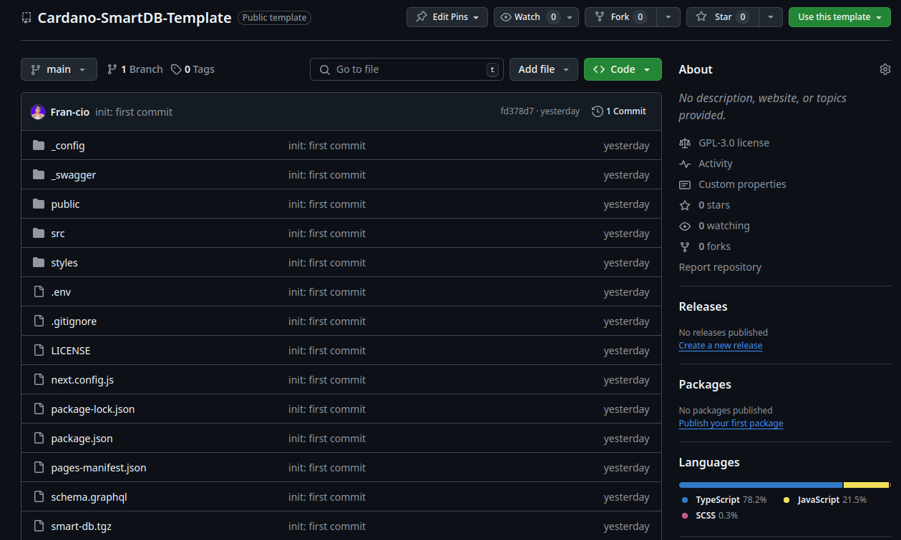
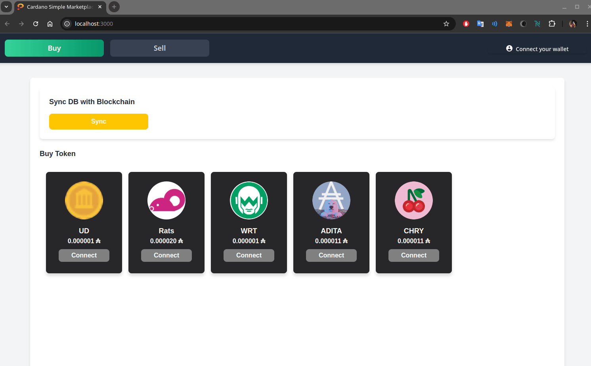
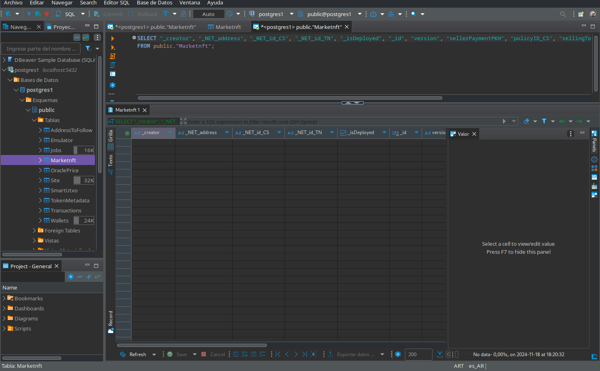
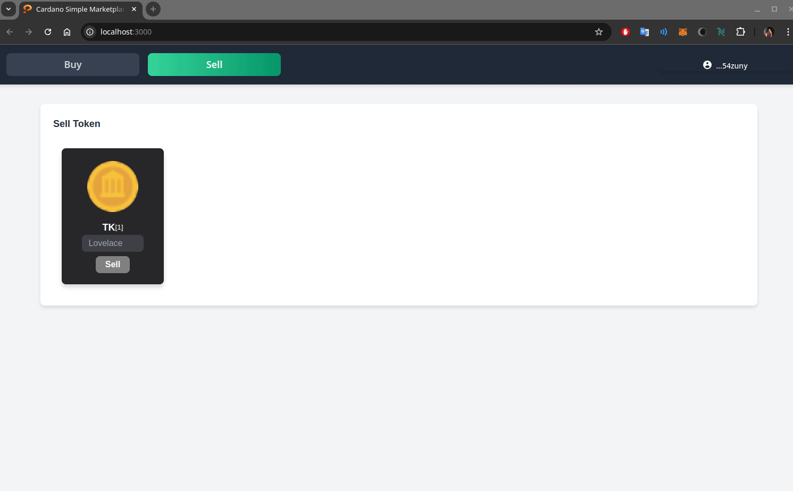
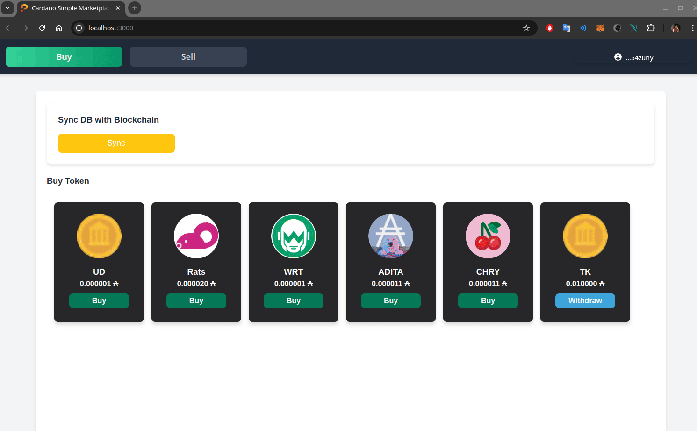
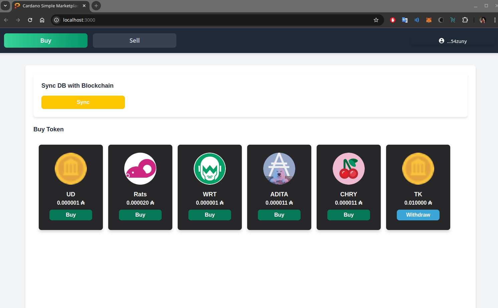

# SmartDB Project Template

This repository serves as a **template** for projects implementing **SmartDB**. It includes predefined configurations and tools to facilitate the development of projects, from scaffolding entities to deploying on-chain components and interacting with a Simple Marketplace.

---

## Table of Contents
- [SmartDB Project Template](#smartdb-project-template)
  - [Table of Contents](#table-of-contents)
  - [Getting Started](#getting-started)
    - [1. Create Your Repository](#1-create-your-repository)
    - [2. Install Dependencies](#2-install-dependencies)
  - [Resources](#resources)
    - [CBOR Files](#cbor-files)
    - [Scaffold Project](#scaffold-project)
  - [Step-by-Step Guide](#step-by-step-guide)
    - [Step 1: Deploy On-Chain Components](#step-1-deploy-on-chain-components)
      - [Generating CBOR Files](#generating-cbor-files)
      - [Generated Files](#generated-files)
      - [Example File Structure](#example-file-structure)
    - [Step 2: Scaffold Entities](#step-2-scaffold-entities)
      - [Generating the Entity Schema](#generating-the-entity-schema)
      - [Schema Explanation](#schema-explanation)
      - [Generating Database Entities](#generating-database-entities)
      - [Directory Structure](#directory-structure)
    - [Clarifications on the Schema and Generated Files](#clarifications-on-the-schema-and-generated-files)
      - [1. `SmartDB` Class in the Schema](#1-smartdb-class-in-the-schema)
      - [2. `Redeemers` Files](#2-redeemers-files)
      - [3. Explanation of the Generated Files](#3-explanation-of-the-generated-files)
        - [**`components` Directory**](#components-directory)
        - [**`lib` Directory**](#lib-directory)
          - [**`SmartDB/BackEnd`**](#smartdbbackend)
          - [**`SmartDB/Entities`**](#smartdbentities)
          - [**`SmartDB/FrontEnd`**](#smartdbfrontend)
        - [**`marketnft.tsx`**](#marketnfttsx)
      - [4. Explanation of Key Fields in `.Entity.ts`](#4-explanation-of-key-fields-in-entityts)
  - [The default **Token Name** is typically defined in both the off-chain and on-chain code. Ensure consistency in both configurations to avoid runtime mismatches.](#the-default-token-name-is-typically-defined-in-both-the-off-chain-and-on-chain-code-ensure-consistency-in-both-configurations-to-avoid-runtime-mismatches)
    - [Step 4: Setup Redeemers Files](#step-4-setup-redeemers-files)
      - [**1. Renaming the Generated Redeemer File**](#1-renaming-the-generated-redeemer-file)
      - [**2. Redeemers Logic**](#2-redeemers-logic)
        - [**Redeemer Types for Minting and Burning Policies**](#redeemer-types-for-minting-and-burning-policies)
        - [**Redeemer Types for Market Actions**](#redeemer-types-for-market-actions)
      - [**3. Implementation in `MarketNFT.Redeemer.ts`**](#3-implementation-in-marketnftredeemerts)
      - [**4. Key Points to Consider**](#4-key-points-to-consider)
    - [Step 5: On-Chain Constants](#step-5-on-chain-constants)
      - [**Key Constants Explained**](#key-constants-explained)
      - [**Steps to Update Constants**](#steps-to-update-constants)
      - [**Example Updated Constants**](#example-updated-constants)
    - [Step 6: Setting Up Home Hooks](#step-6-setting-up-home-hooks)
      - [**Key Elements**](#key-elements)
      - [**Steps for Customization**](#steps-for-customization)
      - [**Code Example**](#code-example)
    - [Step 7: Backend API](#step-7-backend-api)
    - [Step 8: Frontend components](#step-8-frontend-components)
      - [Directory Structure:](#directory-structure-1)
      - [`Sell` Component:](#sell-component)
      - [`Buy` and `Withdraw` Components:](#buy-and-withdraw-components)
      - [Useful Components](#useful-components)
        - [**Wallet Connector Handler**](#wallet-connector-handler)
        - [**Synchronization Button**](#synchronization-button)
        - [**Fetching Token Information as a List**](#fetching-token-information-as-a-list)
        - [**Note**](#note)
    - [Step 9: All You Can Code](#step-9-all-you-can-code)
    - [Step 10: How to Run It](#step-10-how-to-run-it)
  - [How to Use the Web Page](#how-to-use-the-web-page)
    - [Interacting with the Simple Marketplace](#interacting-with-the-simple-marketplace)


---

## Getting Started

### 1. Create Your Repository

1. Click the **"Use this template"** button at the top of this repository.  
2. Name your new repository and set it to public or private.  
3. Clone your newly created repository to your local environment.



```bash
git clone https://github.com/<your_username>/<your_repo_name>.git
cd <your_repo_name>
```

### 2. Install Dependencies

Run the following command to install all required dependencies:

```bash
npm install
```

## Resources

### CBOR Files

To start the project, you need the **CBOR files** of the Plutus smart contracts you plan to implement. These files are essential for deploying and interacting with on-chain scripts.  
- CBOR files can be generated using the appropriate Plutus tools or your preferred Haskell development environment.  
- For details on generating CBOR files, see [Step 2: Deploy On-Chain Components](#step-2-deploy-on-chain-components).

### Scaffold Project

You must install the **Scaffold Project** to define and generate your SmartDB entities.  
The Scaffold Project provides tools for:  
- Creating database schemas.  
- Generating TypeScript types for both MongoDB and PostgreSQL.

To get started with the Scaffold Project, follow the instructions in its [official repository](https://github.com/protofire/Cardano-SmartDB-Scaffold/tree/main?tab=readme-ov-file#introduction).  

Once installed, you can use the scaffold commands to generate entities for your SmartDB project.

## Step-by-Step Guide

Aquí tienes la sección actualizada **Step 2: Deploy On-Chain Components** junto con la subsección para mostrar los archivos generados y aclarar el uso de la policy sin parámetros aplicados:  

---

### Step 1: Deploy On-Chain Components

For this template, we use a **Plutus contract** specifically developed for the Simple Marketplace example.  
The contract can be found in the [Cardano-Simple-Marketplace repository](https://github.com/protofire/Cardano-Simple-Marketplace/tree/main/on-chain).  

#### Generating CBOR Files

To generate the **CBOR files** required to deploy the on-chain components, use the scripts provided in the [on-chain documentation](https://github.com/protofire/Cardano-Simple-Marketplace/blob/main/docs/onchain.md#key-functions-of-clish).  

1. Clone the **Cardano-Simple-Marketplace** repository:  
   ```bash
   git clone https://github.com/protofire/Cardano-Simple-Marketplace.git
   cd Cardano-Simple-Marketplace
   ```
2. Follow the instructions in the `docs/onchain.md` to execute the scripts for generating the necessary CBOR files for the validator and policies.  


#### Generated Files

The following files will be generated after running the scripts:  
- `marketValidator.plutus` – The CBOR representation of the marketplace validator script.  
- `PolicyID.plutus` – The CBOR representation of the minting policy.  

> - The **PolicyID.plutus** is generated without applying specific parameters. This allows flexibility to set parameters in the **off-chain code** dynamically, enabling the reuse of the validator in various contexts.  
> - Ensure the generated CBOR files are copied to the appropriate directory in your SmartDB project (e.g., `/src/contracts`) for integration with your off-chain application.

#### Example File Structure
After generating and copying the CBOR files, your project structure should look like this:  
```
 Market
├──  app
│   └──  deploy.hs
├──  export
│   └──  MarketValidator
│       └──  2024-11-18-02-03
│           ├──  marketValidator-HEX.addr
│           ├──  marketValidator-Mainnet.addr
│           ├──  marketValidator-Testnet.addr
│           ├──  marketValidator.hash
│           ├──  marketValidator.plutus
│           └──  PolicyID.plutus
├──  scripts
```

By following these steps, you will have all the on-chain components ready for integration with the SmartDB template.

Aquí está la sección **Step 2: Scaffold Entities**, con la explicación del esquema y los comandos correspondientes, además de las solicitudes para agregar un GIF y un árbol de directorios:  

---

### Step 2: Scaffold Entities

To define and generate the **entities** used in this project, we use the `smartdb-graphql-gen` command, provided by the Scaffold project. This command generates a schema for entity creation.  

#### Generating the Entity Schema

Run the following command in your terminal:  

```bash
smartdb-graphql-gen
```  

The command will generate the **GraphQL schema** for defining your entities. Below is an example schema used for the Simple Marketplace:  

  
*GIF: Using the `smartdb-graphql-gen` command to generate the entity schema.*  

---

#### Schema Explanation

Here is the schema used to define the `MarketNFT` entity:

```graphql
type MarketNFT @smartDBEntity  @especialImports(fromSmart_db:["type CS", "type TN"], fromLucid_cardano:["type PaymentKeyHash"]) @index(indexName:["sellerPaymentPKH"]) {
    version: String @especialType(typeName:"bigint") @convertible(params:["isForDatum: true"])
    sellerPaymentPKH: String @especialType(typeName:"PaymentKeyHash") @convertible(params:["isForDatum: true"])
    policyID_CS: String @especialType(typeName:"CS") @convertible(params:["isForDatum: true"])
    sellingToken_CS: String @especialType(typeName:"CS") @convertible(params:["isForDatum: true"])
    sellingToken_TN: String @especialType(typeName:"TN") @convertible(params:["isForDatum: true"])
    priceOfAsset: String @especialType(typeName:"bigint") @convertible(params:["isForDatum: true"])
    minADA: String @especialType(typeName:"bigint") @convertible(params:["isForDatum: true"])
}
```

Explanation of fields and annotations:

| Field               | Type             | Description                                                                                     |
|---------------------|------------------|-------------------------------------------------------------------------------------------------|
| `version`           | `bigint`         | Version of the marketplace entity, marked as convertible for on-chain Datum compatibility.      |
| `sellerPaymentPKH`  | `PaymentKeyHash` | The seller's payment public key hash. Also marked for Datum compatibility.                      |
| `policyID_CS`       | `CS`             | Policy ID of the asset being sold, defined as a Cardano script type (CS).                       |
| `sellingToken_CS`   | `CS`             | Policy ID of the selling token.                                                                 |
| `sellingToken_TN`   | `TN`             | Token name of the selling token, represented as a Cardano type (TN).                            |
| `priceOfAsset`      | `bigint`         | Price of the asset in lovelace.                                                                 |
| `minADA`            | `bigint`         | Minimum ADA required for the transaction. Marked as Datum-compatible.                           |

**Annotations:**  
- `@smartDBEntity`: Marks the type as an entity for the SmartDB framework.  
- `@especialImports`: Specifies imports from SmartDB and Lucid libraries, such as `CS`, `TN`, and `PaymentKeyHash`.  
- `@especialType`: Maps the field to a specific type required by SmartDB or Lucid.  
- `@convertible(params:["isForDatum: true"])`: Ensures compatibility with on-chain data structures (Datum).  
- `@index`: Adds a database index for the specified field to optimize queries.

---

#### Generating Database Entities

After defining the schema, use the `smartdb-code-gen` command to generate the database entities:

```bash
smartdb-code-gen
```  

This will create all necessary files, including database migrations and TypeScript types for both MongoDB and PostgreSQL.  
  
*GIF: Using the `smartdb-code-gen` command to generate the entities.*  

---

#### Directory Structure

After running the `smartdb-code-gen` command, the generated files will be placed in the following directory structure:

```
 src
├──  components
│   ├──  public
│   │   ├──  Home
│   │   │   ├──  Home.module.scss
│   │   │   ├──  Home.tsx
│   │   │   └──  useHome.ts
│   │   └──  MarketNFT
│   │       ├──  MarketNFT.module.scss
│   │       └──  MarketNFT.tsx
│   └──  UI
│       └──  Layout
│           ├──  Layout.module.scss
│           └──  Layout.tsx
├──  lib
│   ├──  Commons
│   │   └──  Constants
│   │       ├──  onchain.ts
│   │       └──  transactions.ts
│   └──  SmartDB
│       ├──  BackEnd
│       │   ├──  index.ts
│       │   └──  MarketNFT.BackEnd.Api.Handlers.ts
│       ├──  Entities
│       │   ├──  Redeemers
│       │   │   └──  xxx.Redeemer.ts
│       │   ├──  index.BackEnd.ts
│       │   ├──  index.ts
│       │   ├──  MarketNFT.Entity.Mongo.ts
│       │   ├──  MarketNFT.Entity.PostgreSQL.ts
│       │   └──  MarketNFT.Entity.ts
│       ├──  FrontEnd
│       │   ├──  index.ts
│       │   └──  MarketNFT.FrontEnd.Api.Calls.ts
│       └──  backEnd.ts
└──  pages
    ├── 󰒍 api
    │   ├──  auth
    │   │   └──  [...nextauth].ts
    │   └──  [[...query]].ts
    ├──  _app.tsx
    ├──  _document.tsx
    ├──  index.module.scss
    ├──  index.tsx
    └──  marketnft.tsx
```

With these steps completed, your project is ready to integrate the generated entities with SmartDB and the rest of your application.

**Recommendation:**  
To maintain greater compatibility with the SmartDB library, it is recommended to use **`bigint`** for numeric types whenever possible. This ensures smooth integration with both on-chain and off-chain components and avoids potential data type conflicts.
### Clarifications on the Schema and Generated Files  

#### 1. `SmartDB` Class in the Schema  

When the schema was generated, the **`SmartDB`** class was included.  
This class is essential because it is used to store and manage information related to a **smart contract**, ensuring synchronization between the backend (database) and the frontend (user interaction).  

#### 2. `Redeemers` Files  

In the directory:  
```bash
├──  Entities
│   ├──  Redeemers
│   │   └──  xxx.Redeemer.ts
```

The file `xxx.Redeemer.ts` should ideally be renamed to **`MarketNFT.Redeemer.ts`**, reflecting the specific redeemers applied in the on-chain code.  

However, this file is **not generated automatically** because redeemers depend on the on-chain logic and must be implemented by the user based on the application's requirements.  

#### 3. Explanation of the Generated Files  

Below is a detailed description of the generated files and their roles in the project:  

##### **`components` Directory**  
- **`public/MarketNFT/MarketNFT.module.scss`**  
  Styles specific to the **MarketNFT** component for the frontend.  
- **`public/MarketNFT/MarketNFT.tsx`**  
  React component for displaying and interacting with **MarketNFT** data on the web page.

##### **`lib` Directory**  

###### **`SmartDB/BackEnd`**  
- **`MarketNFT.BackEnd.Api.Handlers.ts`**  
  Backend API handlers for managing requests related to the **MarketNFT** entity. These include functions for retrieving, updating, or interacting with the database and the blockchain.

###### **`SmartDB/Entities`**  
- **`MarketNFT.Entity.Mongo.ts`**  
  MongoDB schema definition for the **MarketNFT** entity.  
- **`MarketNFT.Entity.PostgreSQL.ts`**  
  PostgreSQL schema definition for the **MarketNFT** entity.  
- **`MarketNFT.Entity.ts`**  
  Common TypeScript definitions for the **MarketNFT** entity, ensuring consistency between the backend and the frontend.

###### **`SmartDB/FrontEnd`**  
- **`MarketNFT.FrontEnd.Api.Calls.ts`**  
  API calls for the frontend to interact with backend endpoints for **MarketNFT**. This acts as a bridge between the frontend UI and backend logic.

##### **`marketnft.tsx`**  
The main file for initializing and configuring the **MarketNFT** functionality in the application.  

#### 4. Explanation of Key Fields in `.Entity.ts`  

The `.Entity.ts` file contains several important fields that play a crucial role in integrating the on-chain logic with the off-chain implementation. Here's a detailed explanation of the key fields:  

- **`_plutusDataIsSubType`**  
   ```typescript
   protected static _plutusDataIsSubType = false;
   ```
   - **Purpose:** This field indicates whether the datum used is a **subtype** of a parametrized datum.  
   - **Default Value:** `false`.  
   - **Explanation:**  
   - If the datum is a subtype, this value should be set to `true`.  
   - By default, it assumes the datum is not a subtype of a Datum, simplifying initial configurations.  

- **`_is_NET_id_Unique`**  
   ```typescript
   protected static _is_NET_id_Unique = false;
   ```
   - **Purpose:** Determines whether the **NFT ID** in the datum is unique.  
   - **Explanation:**  
   - If `true`, the ID is treated as unique (e.g., for NFTs).  
   - If `false`, it is assumed to be a **fungible token** (FT).  
   - **Note:** The meaning is self-explanatory and does not require additional changes unless working with unique IDs.  

- **`_NET_id_TN`**  
   ```typescript
   _NET_id_TN: string = mintingPolicyID_TN;
   ```
   - **Purpose:** Represents the **token name (TN)** for the minting policy.  
   - **Explanation:**  
   - This field must align the **Token Name (TN)** between the **off-chain** and **on-chain** code to ensure the validator recognizes the token.  
   - The default value (`mintingPolicyID_TN`) should be updated to reflect the agreed **TN** for your use case.  

   **Example Default Setting:**  
   The default **Token Name** is typically defined in both the off-chain and on-chain code. Ensure consistency in both configurations to avoid runtime mismatches.  
---

### Step 4: Setup Redeemers Files  

The redeemers are essential for defining the logic of minting, burning, and market-specific actions in your smart contract. This step explains how to set up the redeemer files correctly and highlights key implementation details.  

#### **1. Renaming the Generated Redeemer File**  

By default, the file is generated with the name `xxx.Redeemer.ts`. This file should be renamed to reflect your project's purpose. For example:  
```bash
├──  Entities
│   ├──  Redeemers
│   │   └──  MarketNFT.Redeemer.ts
```
The renaming aligns the file with the **MarketNFT** entity and helps maintain clarity in the project structure.

#### **2. Redeemers Logic**  

The redeemers define the operations allowed for minting, burning, and market-specific actions. Below is the redeemer logic implemented on-chain:  

##### **Redeemer Types for Minting and Burning Policies**  
- **Mint ID Redeemer (`PolicyRedeemerMintID`)**: Used when minting tokens.  
- **Burn ID Redeemer (`PolicyRedeemerBurnID`)**: Used when burning tokens.  
- **Combined Redeemer (`PolicyIDRedeemer`)**: Represents either a mint or burn operation.  

##### **Redeemer Types for Market Actions**  
- **Buy**: Represents the action of purchasing an item.  
- **Withdraw**: Represents the action of withdrawing funds or assets.  

#### **3. Implementation in `MarketNFT.Redeemer.ts`**  

The implementation translates the above redeemer types and logic into TypeScript using the `smart-db` library.  

```typescript
import { BaseTxRedeemer } from "smart-db";

// Define a type that represents a Redeemer for a Policy ID, 
// which can either be related to Minting or Burning an ID.
export type PolicyIdRedeemer = PolicyRedeemerMintID | PolicyRedeemerBurnID;

// Class for handling a Minting operation on a Policy ID.
export class PolicyRedeemerMintID extends BaseTxRedeemer {
    protected static _plutusDataIndex = 1; // Index for minting redeemer.
    protected static _plutusDataIsSubType = true; // Subtype of general redeemer type.
}

// Class for handling a Burning operation on a Policy ID.
export class PolicyRedeemerBurnID extends BaseTxRedeemer {
    protected static _plutusDataIndex = 2; // Index for burning redeemer.
    protected static _plutusDataIsSubType = true; // Subtype of general redeemer type.
}

// Define a type that represents a Redeemer for Market operations.
export type MarketValidatorRedeemer = Buy | Withdraw;

// Class for handling a Buy operation in the Market.
export class Buy extends BaseTxRedeemer {
    protected static _plutusDataIndex = 0; // Index for buy operation.
    protected static _plutusDataIsSubType = true; // Subtype of market redeemer.
}

// Class for handling a Withdraw operation in the Market.
export class Withdraw extends BaseTxRedeemer {
    protected static _plutusDataIndex = 1; // Index for withdraw operation.
    protected static _plutusDataIsSubType = true; // Subtype of market redeemer.
}
```

#### **4. Key Points to Consider**  

1. **Consistency in Indices**:  
   - The `_plutusDataIndex` values for redeemers must match the indices defined in the on-chain Plutus code:
      ``` haskell
      -- Associate market redeemer constructors with indices for serialization.
      PlutusTx.makeIsDataIndexed
      ''PolicyIDRedeemer
          [ ('PolicyRedeemerMintID, 1)
            , ('PolicyRedeemerBurnID, 2)
          ]
      PlutusTx.makeIsDataIndexed
       ''MarketRedeemer
          [ ('Buy, 0)
            , ('Withdraw, 1)
          ]
      ```
     

2. **Token Name Agreement**:  
   - Ensure that the **Token Name (TN)** and indices in your off-chain code align with the on-chain minting policy.  

3. **Custom Redeemers**:  
   - You can extend this setup to include additional redeemers specific to your application's requirements.  


By completing this step, you ensure a seamless connection between the on-chain and off-chain redeemer logic, enabling robust functionality in your project.

### Step 5: On-Chain Constants  

In this step, we define the constants required for the on-chain implementation. These constants represent fixed elements such as scripts, the minting policy name, and conversion values. Customizing these constants ensures proper interaction between the on-chain and off-chain components.  

#### **Key Constants Explained**  

Here are the constants defined in the code, with their purposes and default values:

```typescript
import { SpendingValidator, MintingPolicy } from 'lucid-cardano';

// Token Name for the Minting Policy.
export const mintingPolicyID_TN = 'EntityPolicyID'; 
```
- **`mintingPolicyID_TN`**: Represents the **Token Name (TN)** for the minting policy.  
  - Default value: `'EntityPolicyID'`.  
  - You should replace this value with the agreed-upon token name for your project.  

```typescript
// Marketplace versioning for flexibility in updates.
export const marketPlaceVersion = 1;
```
- **`marketPlaceVersion`**: Identifies the current version of the marketplace logic.  
  - Default value: `1`.  
  - Increment this value as the marketplace logic evolves.  

```typescript
// Conversion factor from Lovelace to ADA.
export const lovelaceToAda = BigInt(1_000_000);
```
- **`lovelaceToAda`**: Conversion constant for translating Lovelace (smallest unit in Cardano) to ADA.  
  - Default value: `1_000_000`.  

```typescript
// Spending validator for the marketplace logic.
export const validatorScript: SpendingValidator = {
    type: 'PlutusV2',
    script: 'xxx',
};
```
- **`validatorScript`**: The on-chain spending validator.  
  - **`type`**: Specifies the script version, here `PlutusV2`.  
  - **`script`**: Placeholder for the serialized Plutus script (`'xxx'` should be replaced with the actual CBORHex).  

```typescript
// Minting policy in CBORHex format.
export const mintingPolicyIDPreScriptCBORHEX = 'xxx';
```
- **`mintingPolicyIDPreScriptCBORHEX`**: Placeholder for the serialized CBORHex of the minting policy script.  
  - Replace `'xxx'` with the actual CBORHex.  
  - This implementation, give us the posibility off define the minting policy applying params.
```typescript
// Minting policy object.
export const mintingPolicyIDPreScript: MintingPolicy = {
    type: 'PlutusV2',
    script: mintingPolicyIDPreScriptCBORHEX,
};
```
- **`mintingPolicyIDPreScript`**: Represents the minting policy in a structured format.  
  - **`type`**: Specifies the script version (`PlutusV2`).  
  - **`script`**: Uses the `mintingPolicyIDPreScriptCBORHEX`.  

#### **Steps to Update Constants**  

1. **Replace the `xxx` placeholders**:  
   - Update the `validatorScript` and `mintingPolicyIDPreScriptCBORHEX` with the actual serialized scripts generated from your on-chain code.  

2. **Ensure consistency**:  
   - Verify that the **Token Name (TN)** matches the value used in the on-chain minting policy.  

3. **Adapt to project needs**:  
   - Modify `marketPlaceVersion` or add additional constants as necessary for your implementation.  

#### **Example Updated Constants**  

```typescript
export const mintingPolicyID_TN = 'MarketNFTPolicyID';

export const marketPlaceVersion = 1;

export const lovelaceToAda = BigInt(1_000_000);

export const validatorScript: SpendingValidator = {
    type: 'PlutusV2',
    script: '4d01000033...',
};

export const mintingPolicyIDPreScriptCBORHEX =
    '590c4c01000033...';

export const mintingPolicyIDPreScript: MintingPolicy = {
    type: 'PlutusV2',
    script: mintingPolicyIDPreScriptCBORHEX,
};
```

By configuring these constants appropriately, you ensure proper integration of on-chain components with your off-chain codebase.

### Step 6: Setting Up Home Hooks  

The `useHome.ts` file is a critical part of the architecture, enabling interaction with on-chain components and the application state. While its exact implementation will vary depending on your specific project, here we outline its key elements and provide guidance on customization.  

#### **Key Elements**  

1. **Wallet Management**  
   ```typescript
   const walletStore = useWalletStore();
   ```
   - The `walletStore` provides utilities for managing wallets, such as state, connections, and blockchain interactions.  
   - This utility comes directly from the **SmartDB library**.  

2. **Global Application State**  
   ```typescript
   const { appState, setAppState } = useContext(AppStateContext);
   const { validatorScript, validatorAddress, mintingPolicyIDPreScript, mintingPolicyIDScript } = appState;
   ```
   - The application uses a **React Context** (`AppStateContext`) to manage and share global state across components.  
   - These states include key blockchain components, such as validator scripts and minting policies, which were initially set up in the `_app.tsx` file:  
     ```
     └──  pages
         ├──  _app.tsx
     ```  

3. **Wallet Connector Modal State**  
   ```typescript
   const [isWalletConnectorModalOpen, setIsWalletConnectorModalOpen] = useState(false);
   ```
   - This state is optional and supports implementing a graphical interface for wallet management.  

4. **Script Initialization**  
   ```typescript
   async function generateScripts(lucid: Lucid) {}
   ```
   - This function initializes key blockchain-related variables (Currency Simbols, Validator Addresses, etc.) in the app state.  
   - It utilizes the Lucid library's utilities, such as `applyParamsToScript` and `mintingPolicyToId`.  

5. **SmartDB Entity Integration**  
   ```typescript
   // import { xxxEntity } from '@example/src/lib/SmartDB/Entities/xxx.Entity';
   // await BaseSmartDBFrontEndApiCalls.createHookApi(xxxEntity, newAppState.validatorAddress!, newAppState.mintingPolicyID_CS!);
   ```
   - **Important**: Uncomment and replace `xxx` with the name of your entity.  
   - This line integrates the SmartDB entity with blockchain synchronization, enabling real-time updates between the network and the database.  

#### **Steps for Customization**  

1. **Replace `xxx` with your entity name**  
   ```typescript
   // Example:
   import { MarketNFTEntity } from '@example/src/lib/SmartDB/Entities/MarketNFT.Entity';
   await BaseSmartDBFrontEndApiCalls.createHookApi(
       MarketNFTEntity, 
       newAppState.validatorAddress!, 
       newAppState.mintingPolicyID_CS!
   );
   ```
   - This enables the app to synchronize blockchain state with the corresponding database entity.  

2. **Configure `appState` Variables**  
   - Update `validatorScript`, `mintingPolicyIDPreScript`, and other related variables in `_app.tsx` to match your project's configuration.  

3. **Use `generateScripts` to Set Up On-Chain Components**  
   - Ensure that `generateScripts` generates and sets up all required variables in the global app state.  

4. **Integrate the Wallet Connector Modal (if applicable)**  
   - If you opt for a graphical wallet interface, ensure the modal's state (`isWalletConnectorModalOpen`) is correctly connected to your UI components.  

#### **Code Example**  

Here's a completed example of the hook with the `MarketNFTEntity` integrated:  

```typescript
import { useContext, useEffect, useState } from 'react';
import { MarketNFTEntity } from '@example/src/lib/SmartDB/Entities/MarketNFT.Entity';
import { CS, useWalletStore } from 'smart-db';
import { AppStateContext } from '@/pages/_app';
import { applyParamsToScript, Lucid, MintingPolicy } from 'lucid-cardano';

export const useHome = () => {
    const walletStore = useWalletStore();
    const { appState, setAppState } = useContext(AppStateContext);
    const { validatorScript, validatorAddress, mintingPolicyIDPreScript, mintingPolicyIDScript } = appState;
    const [isWalletConnectorModalOpen, setIsWalletConnectorModalOpen] = useState(false);

    async function generateScripts(lucid: Lucid) {
        let newAppState = { ...appState };

        if (mintingPolicyIDScript === undefined || validatorAddress === undefined) {
            const mintingPolicyIDScript_: MintingPolicy = {
                type: 'PlutusV2',
                script: applyParamsToScript(
                    mintingPolicyIDPreScript?.script, 
                    [lucid.utils.validatorToScriptHash(validatorScript)]
                ),
            };

            const policyID_CS: CS = lucid.utils.mintingPolicyToId(mintingPolicyIDScript_);
            newAppState = { mintingPolicyIDScript: mintingPolicyIDScript_, mintingPolicyID_CS: policyID_CS, ...newAppState };

            console.log(`mintingPolicyID_CS: ${policyID_CS}`);

            const marketAddress_ = lucid.utils.validatorToAddress(validatorScript);
            newAppState = { validatorAddress: marketAddress_, ...newAppState };

            console.log(`marketAddress: ${marketAddress_}`);

            setAppState(newAppState);

            await BaseSmartDBFrontEndApiCalls.createHookApi(
                MarketNFTEntity, 
                newAppState.validatorAddress!, 
                newAppState.mintingPolicyID_CS!
            );
        }
    }

    useEffect(() => {
        const fetch = async () => {
            if (walletStore._lucidForUseAsUtils === undefined) return;
            try {
                await generateScripts(walletStore._lucidForUseAsUtils);
            } catch (e) {
                console.error(e);
            }
        };
        fetch();
    }, [walletStore._lucidForUseAsUtils]);

    return {
        isWalletConnectorModalOpen,
        setIsWalletConnectorModalOpen,
    };
};
```

By setting up `useHome.ts` correctly, you ensure robust synchronization between your app, blockchain, and SmartDB.

### Step 7: Backend API

In the generated files, you will find the following structure:

```
 SmartDB
│  ├──  BackEnd
│     │   └──  MarketNFT.BackEnd.Api.Handlers.ts
```

This file contains a template like the following:

```typescript
import { NextApiResponse } from 'next';
import {
    BackEndApiHandlersFor,
    BackEndAppliedFor,
    BaseSmartDBBackEndApiHandlers,
    BaseSmartDBBackEndApplied,
    BaseSmartDBBackEndMethods,
    NextApiRequestAuthenticated,
    console_error,
} from 'smart-db/backEnd';
import { MarketNFTEntity } from '../Entities/MarketNFT.Entity';

@BackEndAppliedFor(MarketNFTEntity)
export class MarketNFTBackEndApplied extends  BaseSmartDBBackEndApplied  {
    protected static _Entity = MarketNFTEntity;
    protected static _BackEndMethods =  BaseSmartDBBackEndMethods;
}

@BackEndApiHandlersFor(MarketNFTEntity)
export class MarketNFTApiHandlers extends  BaseSmartDBBackEndApiHandlers   {
    protected static _Entity = MarketNFTEntity;
    protected static _BackEndApplied = MarketNFTBackEndApplied;

    // #region custom api handlers

    protected static _ApiHandlers: string[] = ['tx'];

    protected static async executeApiHandlers(command: string, req: NextApiRequestAuthenticated, res: NextApiResponse) {
        //--------------------
        const { query } = req.query;
        //--------------------
        if (this._ApiHandlers.includes(command) && query !== undefined) {
            if (query[0] === 'tx') {
                if (query.length === 2) {
                    if (query[1] === 'sell-nft-tx') {
                        return await this.sellTxApiHandler(req, res);
                    } else if (query[1] === 'buy-nft-tx') {
                        return await this.buyTxApiHandler(req, res);
                    } else if (query[1] === 'withdraw-nft-tx') {
                        return await this.withdrawTxApiHandler(req, res);
                    }
                }
                return res.status(405).json({ error: "Wrong API route" });
            } else {
                console_error(0, this._Entity.className(), `executeApiHandlers - Error: API Handler function not found`);
                return res.status(500).json({ error: "API Handler function not found" });
            }
        } else {
            console_error(0, this._Entity.className(), `executeApiHandlers - Error: Wrong Custom API route`);
            return res.status(405).json({ error: "Wrong Custom API route" });
        }
    }

    // #endregion custom api handlers
}
```

In this setup, you can uncomment the following lines and modify them according to the behavior needed:

```typescript
// if (query[1] === 'create-dummy-tx') {
//     return await this.createTxApiHandler(req, res);
// } else if (query[1] === 'claim-dummy-tx') {
//     return await this.claimTxApiHandler(req, res);
// } else if (query[1] === 'update-dummy-tx') {
//     return await this.updateTxApiHandler(req, res);
// }
```

The lines are adjusted as follows for specific transaction actions:

```typescript
if (query[1] === 'sell-nft-tx') {
    return await this.sellTxApiHandler(req, res);
} else if (query[1] === 'buy-nft-tx') {
    return await this.buyTxApiHandler(req, res);
} else if (query[1] === 'withdraw-nft-tx') {
    return await this.withdrawTxApiHandler(req, res);
}
```

Here is an example implementation for the `sellTxApiHandler`, which processes the "sell NFT" transaction:

```typescript
// Handler to create a Sell NFT transaction
public static async sellTxApiHandler(req: NextApiRequestAuthenticated, res: NextApiResponse) {
   if (req.method === 'POST') {
      console_log(1, this._Entity.className(), `Sell Tx - POST - Init`);
      try {
            const sanitizedBody = sanitizeForDatabase(req.body);

            // Destructure required parameters from the request body
            const {
               walletTxParams,
               txParams,
            }: {
               walletTxParams: WalletTxParams;
               txParams: SellMarketNFTTxParams;
            } = sanitizedBody;

            console_log(0, this._Entity.className(), `Sell Tx - txParams: ${showData(txParams)}`);

            // Emulator sync for development environment only
            if (isEmulator) {
               // await TimeBackEnd.syncBlockChainWithServerTime()
            }

            // Prepare Lucid for transaction handling and wallet info
            const { lucid } = await LucidToolsBackEnd.prepareLucidBackEndForTx(walletTxParams);
            const { utxos: uTxOsAtWallet, address } = walletTxParams;

            // Extract transaction parameters related to the asset for sale
            const { priceOfAsset, token_TN, token_CS, datumID_CS, datumID_TN, validatorAddress, mintingPolicyID } = txParams;

            const paymentPKH = addressToPubKeyHash(address);

            // Generate datum object with relevant sale data and no min ADA yet
            const datumPlainObject_NoMinADA = {
               version: marketPlaceVersion,
               sellerPaymentPKH: paymentPKH,
               policyID_CS: datumID_CS,
               sellingToken_CS: token_CS,
               sellingToken_TN: strToHex(token_TN),
               priceOfAsset: BigInt(priceOfAsset),
               minADA: BigInt(0),
            };

            const lucidAC_MintID = datumID_CS + strToHex(datumID_TN);
            const valueFor_Mint_ID: Assets = { [lucidAC_MintID]: 1n };

            let valueFor_MarketNFTDatum_Out: Assets = valueFor_Mint_ID;
            const lucidAC_sellerToken = token_CS + strToHex(token_TN);
            const valueOfSellerToken: Assets = { [lucidAC_sellerToken]: 1n };

            // Add additional values to the transaction, including minimum ADA requirement
            valueFor_MarketNFTDatum_Out = addAssetsList([valueOfSellerToken, valueFor_MarketNFTDatum_Out]);
            const minADA_For_MarketNFTDatum = calculateMinAdaOfUTxO({
               datum: MarketNFTEntity.datumToCborHex(datumPlainObject_NoMinADA),
               assets: valueFor_MarketNFTDatum_Out,
            });
            const value_MinAda_For_MarketNFTDatum: Assets = {
               lovelace: minADA_For_MarketNFTDatum,
            };
            valueFor_MarketNFTDatum_Out = addAssetsList([value_MinAda_For_MarketNFTDatum, valueFor_MarketNFTDatum_Out]);

            // Generate datum object with min ADA calculated
            const datumPlainObject = {
               ...datumPlainObject_NoMinADA,
               minADA: BigInt(minADA_For_MarketNFTDatum),
            };

            // Create and encode the datum for the transaction
            let marketNftDatum_Out = MarketNFTEntity.mkDatumFromPlainObject(datumPlainObject);
            const marketNftDatum_Out_Hex = MarketNFTEntity.datumToCborHex(marketNftDatum_Out);

            // Create minting policy and redeemers for the sale transaction
            const marketNftPolicyRedeemerMintID = new PolicyRedeemerMintID();
            const marketNftPolicyRedeemerMintID_Hex = objToCborHex(marketNftPolicyRedeemerMintID);

            // Time range setup for the transaction
            const { now, from, until } = await TimeBackEnd.getTxTimeRange();

            let tx: Tx = lucid.newTx();
            tx = tx
               .mintAssets(valueFor_Mint_ID, marketNftPolicyRedeemerMintID_Hex)
               .payToContract(validatorAddress, { inline: marketNftDatum_Out_Hex }, valueFor_MarketNFTDatum_Out)
               .attachMintingPolicy(mintingPolicyID);

            const txComplete = await tx.complete();
            const txCborHex = txComplete.toString();
            const txHash = txComplete.toHash();

            // Create and save transaction entity in the Smart DB
            const transactionMarketNFTPolicyRedeemerMintID: TransactionRedeemer = {
               tx_index: 0,
               purpose: 'mint',
               redeemerObj: marketNftPolicyRedeemerMintID,
            };

            const transactionMarketNFTDatum_Out: TransactionDatum = {
               address: validatorAddress,
               datumType: MarketNFTEntity.className(),
               datumObj: marketNftDatum_Out,
            };

            const transaction: TransactionEntity = new TransactionEntity({
               paymentPKH: walletTxParams.pkh,
               date: new Date(now),
               type: MARKET_SELL,
               hash: txHash,
               status: TRANSACTION_STATUS_PENDING,
               ids: {},
               redeemers: {
                  marketNftPolicyRedeemerMintID: transactionMarketNFTPolicyRedeemerMintID,
               },
               datums: { marketNftDatum_Out: transactionMarketNFTDatum_Out },
               consuming_UTxOs: [],
            });
            await TransactionBackEndApplied.create(transaction);

            return res.status(200).json({ txCborHex, txHash });
      } catch (error) {
            console_error(-1, this._Entity.className(), `Sell Tx - Error: ${error}`);
            return res.status(500).json({
               error: `An error occurred while creating the ${this._Entity.apiRoute()} Sell Tx: ${error}`,
            });
      }
   } else {
      console_error(-1, this._Entity.className(), `Sell Tx - Error: Method not allowed`);
      return res.status(405).json({ error: `Method not allowed` });
   }
}
```
In this handler, the `sellTxApiHandler` function processes the "sell" transaction, prepares the necessary parameters, constructs the transaction using the `Lucid` library, and stores it in the Smart DB.

In `transactions.ts`, the interface `RedeemerEntityTxParams` defines the expected parameters for the transaction:

```typescript
import { Script } from 'lucid-cardano';
import { scriptSchema, yup } from 'smart-db/backEnd';

export const ENTITY_REDEEMER = 'Entity - Redeemer';

export interface RedeemerEntityTxParams {
    token_TN: string;
    token_CS: string;
    datumID_CS: string;
    datumID_TN: string;
    validatorAddress: string;
    mintingPolicyID: Script;
}

export const redeemerEntityTxParamsSchema = yup.object().shape({
    token_TN: yup.string().required(),
    token_CS: yup.string().required(),
    datumID_CS: yup.string().required(),
    datumID_TN: yup.string().required(),
    validatorAddress: yup.string().required(),
    mintingPolicyID: scriptSchema.required(),
});
```
In this example:
```typescript
export const MARKET_SELL = 'MarketNFT - Sell';

export interface SellMarketNFTTxParams {
    token_TN: string;
    token_CS: string;
    datumID_CS: string;
    datumID_TN: string;
    validatorAddress: string;
    mintingPolicyID: Script;
    validatorMarket: Script;
    priceOfAsset: bigint;
}

export const sellMarketNFTTxParamsSchema = yup.object().shape({
    token_TN: yup.string().required(),
    token_CS: yup.string().required(),
    datumID_CS: yup.string().required(),
    datumID_TN: yup.string().required(),
    validatorAddress: yup.string().required(),
    mintingPolicyID: scriptSchema.required(),
    validatorMarket: scriptSchema.required(),
    priceOfAsset: yup.number().required(),
});
```
This interface ensures that the parameters for creating a transaction are properly validated and used in the backend handlers.

These handlers now integrate the correct parameters from the frontend using the `RedeemerEntityTxParams` interface. The datum creation, transaction setup, and interaction with the contract are now triggered using the extracted transaction parameters.

For the specific implementation of the `Withdraw` and `Buy` handlers, you can find it in the [original code](https://github.com/protofire/Cardano-Simple-Marketplace/blob/main/off-chain/src/lib/SmartDB/BackEnd/MarketNFT.BackEnd.Api.Handlers.ts).

### Step 8: Frontend components

In the `src/components` directory, the main pages are placed, which represent the core behaviors in the application. Specifically, the `Buy`, `Sell`, and `Home` directories contain the pages related to these operations. Both the `Buy` and `Sell` pages implement a token grid, where different actions are performed depending on whether the user wants to buy or sell a token.

#### Directory Structure:

```
├──  public
│   ├──  Buy
│   │   ├──  Buy.module.scss
│   │   ├──  Buy.tsx
│   │   └──  useBuy.ts
│   ├──  Home
│   │   ├──  Home.module.scss
│   │   ├──  Home.tsx
│   │   └──  useHome.ts
│   └──  Sell
│       ├──  Sell.module.scss
│       ├──  Sell.tsx
│       └──  useSell.ts
```

#### `Sell` Component:
The `Sell` component is responsible for selling a token. It calls the backend API to initiate the sale process by passing the necessary transaction parameters. Here's an outline of how the sell functionality is implemented in the component:

- **Transaction Handler**: The `handleBtnSellTx` function is responsible for handling the sell transaction. This function ensures that the wallet is connected and all required parameters (like market address, script, and minting policy ID) are available.
- **Transaction Modal**: If the transaction is being processed, a modal opens to show the loading state. The button is disabled or enabled based on the input validity and transaction loading state.
- **API Call**: Once all conditions are met, the handler sends the transaction details to the API endpoint (`sell-nft-tx`) using the `handleBtnDoTransactionV1` method. If successful, the transaction is confirmed, and the state is updated accordingly.
```tsx
// Function to handle the sell transaction for a specific asset
    const handleBtnSellTx = async () => {
        if (walletStore.isConnected !== true) return; // Ensure wallet is connected
        if (marketAddress === undefined || marketScript === undefined || mintingPolicyIDScript === undefined || mintingPolicyID_CS === undefined) {
            return; // Ensure all required values are available before proceeding
        }
        if (!(isLoadingAnyTx === undefined || isLoadingAnyTx == tokenToSell.CS + tokenToSell.TN_Hex)) return;

        setIsTxModalOpen(true); // Open transaction modal

        if (isLoadingTxSell) return;

        setIsLoadingAnyTx(tokenToSell.CS + tokenToSell.TN_Hex);
        setIsLoadingTxSell(true);

        setTxConfirmed(false);
        const token_TN = hexToStr(tokenToSell.TN_Hex); // Convert token name from hex to string
        const token_CS = tokenToSell.CS; // Get the token's CS value

        try {
            setTxHash(undefined);
            setIsTxError(false);
            setTxMessage('Creating Transaction...'); // Show loading message

            // Set up parameters for the transaction
            const txParams: SellMarketNFTTxParams = {
                token_TN,
                token_CS,
                datumID_CS: mintingPolicyID_CS,
                datumID_TN: mintingPolicyID_TN,
                validatorAddress: marketAddress,
                mintingPolicyID: mintingPolicyIDScript,
                validatorMarket: marketScript,
                priceOfAsset: BigInt(inputValue), // Use the input value as the asset price
            };

            // Call the transaction handler to process the transaction
            const result = await BaseSmartDBFrontEndBtnHandlers.handleBtnDoTransactionV1(
                MarketNFTEntity,
                'Creating MarketNFT...',
                'Create Tx',
                setTxMessage,
                setTxHash,
                walletStore,
                txParams,
                MarketNFTApi.callGenericTxApi_.bind(MarketNFTApi, 'sell-nft-tx')
            );

            if (result === false) {
                throw 'There was an error in the transaction'; // Handle failure
            }

            setTxMessage('Transaction has been confirmed. Refreshing data...');
            setTxConfirmed(result); // Set transaction as confirmed
        } catch (e) {
            console.error(e);
            setTxHash(undefined);
            setIsTxError(true); // Set error flag if transaction fails
        }

        setIsLoadingAnyTx(undefined);
        setIsLoadingTxSell(false);
    };

```
In the frontend implementation, looks like:
```tsx
<div className={styles.inputContainer}>
    <input 
        value={inputValue} 
        onChange={handleInputChange} 
        type="text" 
        placeholder="Lovelace" 
        className={styles.input} 
    />
    {/* Button to connect wallet if not already connected */}
    {!walletStore.isConnected ? (
        <button className={styles.invalidButton} onClick={() => setIsWalletConnectorModalOpen(true)}>
            Connect
        </button>
    ) : (
        // Sell button is conditionally enabled based on validity of input and transaction loading state
        <button
            className={
                !isValidInput || !(isLoadingAnyTx === undefined || isLoadingAnyTx == tokenToSell.CS + tokenToSell.TN_Hex) ? styles.invalidButton : styles.sellButton
            }
            disabled={!isValidInput || !(isLoadingAnyTx === undefined || isLoadingAnyTx == tokenToSell.CS + tokenToSell.TN_Hex)}
            onClick={handleBtnSellTx} // Trigger token sell transaction
        >
            Sell {isLoadingTxSell && <LoaderButton />} {/* Display loader while selling */}
        </button>
    )}
</div>
```

For the full implementation, you can refer to the [TokenSell component](https://github.com/protofire/Cardano-Simple-Marketplace/tree/main/off-chain/src/components/Commons/TokenCard/TokenSell).

#### `Buy` and `Withdraw` Components:
Similar to the `Sell` functionality, the `Buy` and `Withdraw` components are responsible for handling buy transactions and withdrawals respectively. The frontend components for these behaviors also manage the state of the buttons and input fields, sending the required information to the backend API when the user performs an action.

- The buy button is used to initiate the purchase of a token, while the withdraw button is used for withdrawing tokens from the marketplace.
- The `handleBtnBuyTx` and `handleBtnWithdrawTx` functions manage the specific logic for each action, including wallet connection checks, input validation, and calling the respective API endpoints.
- The state is updated accordingly to display transaction messages, success, or error statuses, ensuring the user is kept informed throughout the process.

You can review the complete implementations of the [TokenBuy and TokenWithdraw](https://github.com/protofire/Cardano-Simple-Marketplace/tree/main/off-chain/src/components/Commons/TokenCard/TokenBuy) components in the repository.

#### Useful Components

This section highlights some key components and utility functions that can serve as references or examples for specific implementations in your application. While these implementations are tailored to particular use cases, they can be adapted and extended to suit your project's needs.

##### **Wallet Connector Handler**
A possible implementation for handling wallet connections can be found in the [WalletConnector component](https://github.com/protofire/Cardano-Simple-Marketplace/tree/main/off-chain/src/components/Commons/WalletConnector). This component facilitates the integration of wallet functionality, ensuring a smooth connection and interaction with the user's wallet.

##### **Synchronization Button**
A synchronization button can be implemented to sync market data with the blockchain. Here's an example:

```typescript
// Sync the market data with the blockchain
const handleBtnSync = async () => {
    if (marketAddress === undefined) return;
    setIsLoadingSync(true);
    try {
        // Sync the data and refresh the list
        await MarketNFTApi.syncWithAddressApi(MarketNFTEntity, marketAddress, true);
        refreshList();
        pushSucessNotification(`MarketNFT Sync`, 'Synchronization complete!', false);
    } catch (e) {
        console.error(e);
        pushWarningNotification(`MarketNFT Sync`, 'Synchronization Error' + e);
    }
    setIsLoadingSync(false);
};
```

This button ensures that market data stays up-to-date by calling an API to synchronize with the blockchain and refreshing the displayed data.

##### **Fetching Token Information as a List**
To retrieve a list of tokens with their associated metadata, you can use the following implementation:

```typescript
// Function to load a list of MarketNFTs with metadata
const loadList = async () => {
    // Fetch all MarketNFT entities with specific fields and relations
    const listEntities: MarketNFTEntity[] = await MarketNFTApi.getAllApi_({
        fieldsForSelect: {},
        loadRelations: { smartUTxO_id: true }, // Load related data for smartUTxO_id
    });

    const listTokensWithMetadata: MarketNFTEntityWithMetadata[] = []; // Array to store MarketNFT entities with their metadata
    
    if (listEntities.length === 0) return []; // If no entities are found, return an empty list

    // Map the fetched entities to create a list of tokens with their CS and TN
    const listTokens = listEntities.map((item) => {
        return { CS: item.sellingToken_CS, TN_Hex: item.sellingToken_TN }; // Create a token object with CS and TN
    });

    // Fetch metadata for the tokens
    const listMetadata = await TokenMetadataFrontEndApiCalls.get_Tokens_MetadataApi(listTokens);

    // Combine MarketNFT entities with their corresponding metadata
    for (const item of listEntities) {
        const metadata = listMetadata.find((x) => x.CS === item.sellingToken_CS && x.TN_Hex === item.sellingToken_TN);
        if (metadata !== undefined) {
            listTokensWithMetadata.push({ entity: item, metadata }); // Push the entity and metadata pair into the list
        }
    }

    return listTokensWithMetadata; // Return the combined list of entities with metadata
};
```

This function demonstrates how to fetch token data, link it with metadata, and return a comprehensive list. 

##### **Note**
These implementations are specific to their respective use cases in the provided example application. However, they serve as a starting point or guide to be adapted for your application. By modifying these examples, you can create similar functionality tailored to your project's unique requirements.

### Step 9: All You Can Code

With the information provided in the previous sections, you now have the foundation to implement the basic functionality your application requires. You can build upon this framework to create custom features, add styles, and design components using your preferred architecture and libraries.

Feel free to enhance the project according to your specific needs, incorporating your unique design preferences and workflow.

For further details and advanced use cases, we recommend consulting the official documentation for the SmartDB library at [SmartDB Documentation](https://protofire-docs.gitbook.io/smartdb). Here you will find comprehensive guides, examples, and reference materials to help you maximize the potential of SmartDB in your project.

### Step 10: How to Run It

Now that the implementation is complete, it’s time to install the dependencies and test the functionality of your application. Follow these steps to get your project up and running:

1. **Install the SmartDB Library**  
   Since the SmartDB library is not yet published on npm, you need to install it using the provided package file. Run the following command in your project root directory:  
   ```bash
   npm install ./smart-db.tgz
   ```

2. **Set Up the Environment Variables**  
   Proper configuration of the `.env` file is essential for the application to function correctly. Refer to the [Environment Setup Guide](https://github.com/protofire/Cardano-Simple-Marketplace/blob/main/docs/installation.md#environment-setup) for detailed instructions on how to configure your environment variables.

3. **Start the Development Server**  
   Once the dependencies are installed and the environment is configured, you can start the development server with:  
   ```bash
   npm run dev
   ```

4. **Access the Application**  
   The application will be running automatically on your local server. Open your browser and navigate to:  
   ```
   http://localhost:3000
   ```

Now you’re ready to explore and test the implemented features of your application!


## How to Use the Web Page

### Interacting with the Simple Marketplace

1. Open the web application in your browser (`http://localhost:3000` by default).
2. Perform the following actions:
   - **Use your favorite wallet** using the wallet connector component
   
   - **Keep your database synchronized with the blockchain** using the sync mechanism.
   
   - **List a token for sale** by providing details like price and token metadata.
   
   - **Buy tokens** listed by other users.
   
   - **Withdraw funds** from successful sales.
   

The web interface includes interactive buttons for these actions, making it easy to use.